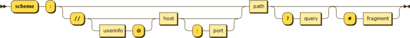
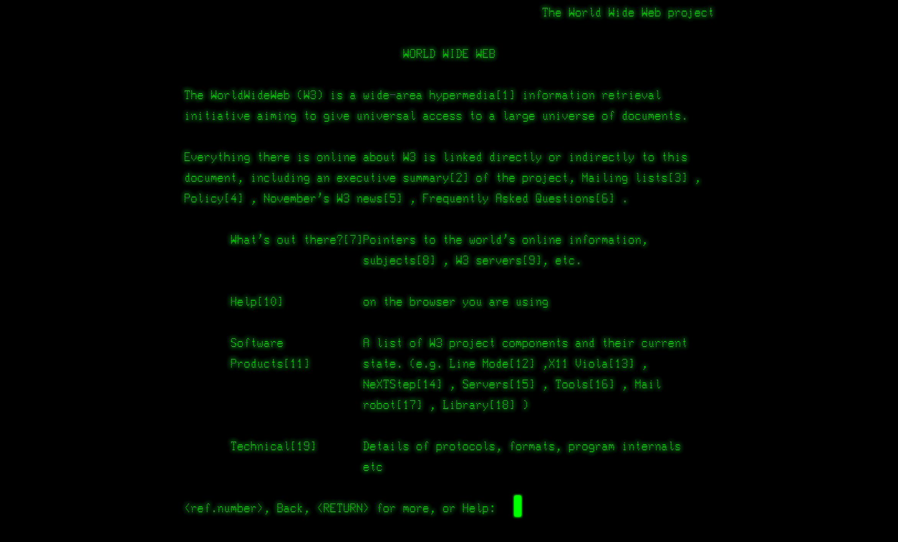

<style>
  strong {
	color: red;
}
</style>
<style scoped>
h1,h2 {
	color: #0bb8e8;
	text-align: center
}
h2 {
	text-align: right
}

</style>

# HTML 基础之创世纪

## :star: by calidion

---

# HTML 到底是什么？

HTML 是一种标记语言
HTML 全称是 HyperText Markup Language
即超文本标记语言
那么什么是超文本呢？

---

# 那么什么是超文本呢？

根据维基百科：

> Hypertext is text displayed on a computer display or other electronic devices with references (hyperlinks) to other text that the reader can immediately access
>
> 所以简单理解就是可以带有超链接的文本，简称超文本。
> 超文本还可以衍生为除了文本外的基于文本表达的多种媒体
> 比如声音，视频等

---

# 为什么要研究超文本技术？

1.  网络基础设施的建设成功
2.  TCP/IP 的成功
3.  网络交换文档的需求，但是最好能交换除文本外的更多东西

---

# 一些超文本的研究

Project Xanadu,
Hypertext Editing System
NLS
HyperCard
**_World Wide Web_**（这个是导致 HTML，HTTP 协议的项目）

---

# World Wide Web 的出现

即通常指的互联网，常简写为 WWW。
所以我们看到很多互联网网站是使用 www.xxx.com 这样的形式的。
其实就是表明这个网站是基于 World Wide Web 这个体系构建的。

World Wide Web 由
**Tim Berners-Lee** （互联网之父）
于**1989**年
在**CERN**（Conseil européen pour la recherche nucléaire）
即欧洲核子研究组织 创建

---

# Tim Berners-Lee（互联网之父）

<style scoped>
img {
	display: block;
  margin: 0 auto;
  height: 15em;
}

</style>

[](./images/Sir_Tim_Berners_Lee.jpg)

---

# World Wide Web 的内容

1.  HTML（Hypertext Markup language, 1991 年)
    超文本标记语言，解决了内容编写的问题
2.  资源定位器（Uniform Resource Locators, 1994)
    资源定位器，解决内容定位的问题
3.  超文本传输协议(Hypertext Transfer Protocol , HTTP, 1991)
    解决了超文本传输的问题
4.  浏览器 (1991 年)
    解决了超文本阅读

---

# 资源定位器

```
URI = scheme:[//authority]path[?query][#fragment]
```

```
authority = [userinfo@]host[:port]
```



示例：

```
https://www.google.com/search?q=god&os=ubuntu#china
```

---
<style scoped>
img {
	display: block;
  margin: 0 auto;
  height: 15em;
}

</style>

# 全世界第一个 HTML 网页

[](./images/Screenshot-World-Wide-Web-project_0.png)
