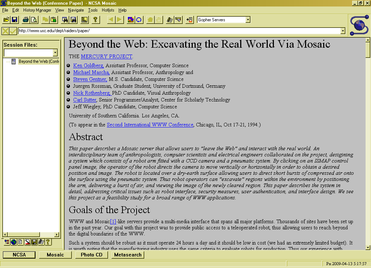
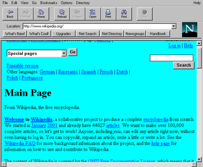

Web全栈班(Node.js)报名QQ：2191038613

HTML基础之浏览器

:star: 田一块

===
---

Web全栈班(Node.js)报名QQ：2191038613

浏览器的发展史或者战争史(一)

==
1. WorldWideWeb是最早的浏览器（Tim Berners-Lee）
它是行浏览器，运行于终端之上，1990年发明，1991 年发布
2. Lynx 终端上的浏览器
目前在Linux平台上还可以使用的终端浏览器

---

Web全栈班(Node.js)报名QQ：2191038613

==

---

Web全栈班(Node.js)报名QQ：2191038613

==

---

Web全栈班(Node.js)报名QQ：2191038613

浏览器的发展史或者战争史(二)

==

3.  Mosaic浏览器
第一个世界流行的浏览器，提供了图形化的界面，1993年发布

---

Web全栈班(Node.js)报名QQ：2191038613

浏览器的发展史或者战争史(三)

==

4.  Netscape Navigator浏览器
是Mosaic团队领导者Marc Andreessen出来创业成立的Netscape公司1994年发布的
发布完即红透世界，成为最受欢迎的浏览器

---

Web全栈班(Node.js)报名QQ：2191038613

==

---

Web全栈班(Node.js)报名QQ：2191038613

==

---

Web全栈班(Node.js)报名QQ：2191038613

浏览器的发展史或者战争史(四)

==
5.  Internet Explorer
微软(Microsoft)在1995年，发布了Internet Explorer，对Netscape Navigator形成挑战
由于微软在操作系统市场的领先地位，以及免费发放IE的原因，IE的市场份额一度在2002年达到95%

---

Web全栈班(Node.js)报名QQ：2191038613

==

&nbsp;

---

Web全栈班(Node.js)报名QQ：2191038613

浏览器的发展史或者战争史(五)

==
6.  Firefox
在绝望中，Netscape公司在1998年成立了Mozilla Foundation，并以开源的模式运行浏览器。这个工作的成果就是现在的Firefox。并在2004年发布了第一个版本。到2011年为止，Firefox的市场份额达到了28%。

---

Web全栈班(Node.js)报名QQ：2191038613

==

---

Web全栈班(Node.js)报名QQ：2191038613

浏览器的发展史或者战争史(六)

==

7. Safari /səˈfɑːri/
苹果在2003年发布了Safari，用于他自己的Mac OS平台之上。但是Safari在其它平台完全没有影响力。Safari是对KDE的浏览器项目Konqueror的分支。

---

Web全栈班(Node.js)报名QQ：2191038613

==

---

Web全栈班(Node.js)报名QQ：2191038613

浏览器的发展史或者战争史(七)

==

8. Chrome
2008年谷歌公司发布了Chrome，由于Chrome的速度非常快，很快成为了市场的领导者。
Chrome的渲染引擎是基于WebKit的，也就是苹果的Safari的引擎。所以谷歌的主层权不强，所以谷歌自己又分支了一个版本叫Blink。
而Blink越来越成为主流的浏览器引擎
Chrome有开源社区版本Chromium

---

Web全栈班(Node.js)报名QQ：2191038613

==

---

Web全栈班(Node.js)报名QQ：2191038613

==

---

Web全栈班(Node.js)报名QQ：2191038613

现代浏览器的能力

==
与最早期的行浏览器不同
现代的浏览器都是至少具备同时解释
HTML、CSS、JS
能力的
同时还要能解释音频、视频、图片等
至少包括两种引擎：
1. 处理Javascript与DOM、AJAX，BOM等功能的JS引擎
2. 处理HTML+CSS的渲染引擎，通常叫浏览器引擎

---

Web全栈班(Node.js)报名QQ：2191038613

现代浏览器的工作原理

==

---

Web全栈班(Node.js)报名QQ：2191038613

==
## 主要浏览器的引擎
| 浏览器 | 渲染引擎 | JS引擎 | 厂家 |
| --- | --- | --- | --- |
| Chrome / Chromium | WebKit -> Blink | V8 | Google |
| Edge| Trident -> EdgeHTML ->Blink  |  Chakra | Microsoft |
| Firefox | Gecko | SpiderMonkey | Mozilla |
| Safari | WebKit | JavascriptCore | Apple |

---

Web全栈班(Node.js)报名QQ：2191038613

==
## 主要浏览器的引擎
| 浏览器 | 渲染引擎 | JS引擎 | 厂家 |
| --- | --- | --- | --- |
| Chrome / Chromium | WebKit -> Blink | V8 | Google |
| Edge/IE | Trident -> EdgeHTML ->Blink  |  Chakra | Microsoft |
| Firefox | Gecko | SpiderMonkey | Mozilla |
| Safari | WebKit | JavascriptCore | Apple |

